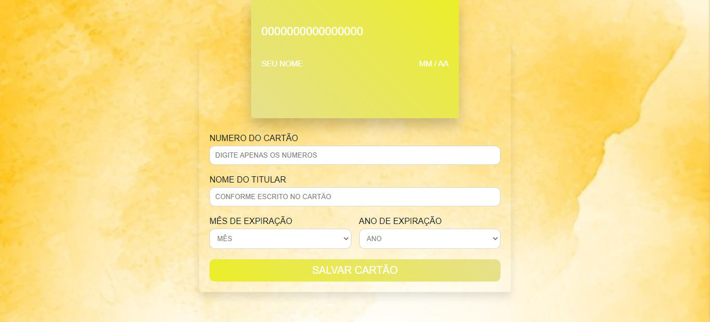
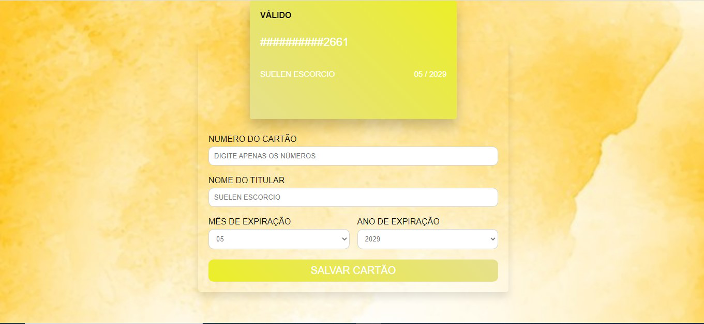

# Cartão de Crédito Válido

## Índice

- [1. Sobre o Produto](#1-Sobre-o-Produto)
- [2. Como usar?](#-2Como-usar?])
- [3. Tecnologias Utilizadas](#3-Tecnologias-Utilizadas)
- [4. Resultado](#4-Resultado)

---

## 1. 💳 Sobre o Produto

O Pay Lab é um website que viabiliza guardar as suas informações de pagamento
de forma segura, como seu cartão de crédito e débito. E já previamente, diz 
se o seu cartão está válido. 
Website voltado para pessoas que querem facilitar sua forma de pagamento para
compras online e se manter seguros contra possivéis golpes e roubo de dados.

## 2. 🧷 Como usar?

Informe seus dados, corretamente, para validação do cartão.
A válidação é feita através do [algaritmo de Luhn](https://en.wikipedia.org/wiki/Luhn_algorithm),
também chamado de módulo 10, é um método de soma de verificação, usado para validar
números de identificação, como o IMEI de telefones celulares, cartões de crédito
etc.
Observações importantes: 
📍 No campo de número de cartão, digite apenas os números do seu cartão, sem nenhum traço.

📍 Digite o nome do titular conforme escrito no cartão.

📍 Fique atento ao mês e ano de vencimento, para preencher corretamente.

📍 A situação do seu cartão será avisa no canto superior esquerdo do cartão de amostra. 

## 3. 💻 Tecnologias Utilizadas
📍 HTML 5
📍 CSS3
📍 JavaScript
📍 Node.js

## 4. Protótipo 

## 4. 🟢 Resultado
Tela Inicial

Tela de cartão

Tela Cartão Válido

Tala CArtão Inválido

